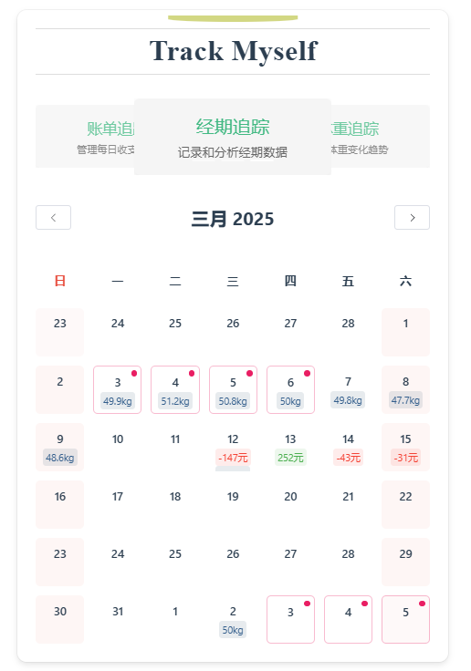
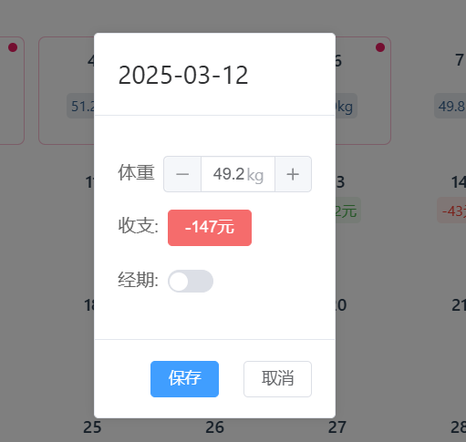
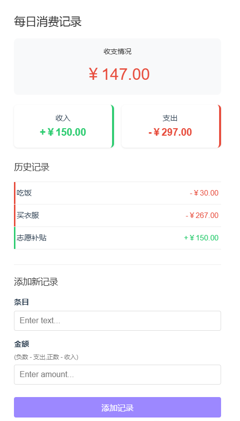

# Track-Myself开发文档

**Track-Myself**是一个基于 **Vue 3** 的个人追踪信息应用，支持体重管理、财务记录和经期追踪功能。用户可以通过日历界面直观地查看和管理每日数据，并通过图表和统计数据分析趋势。

------

## **功能概览**

1. **体重追踪**：
   - 记录每日体重。
   - 查看月度体重趋势图。
   - 计算月平均体重和体重变化。
2. **财务追踪**：
   - 添加每日收入和支出记录。
   - 查看每日、月度和年度财务统计。
   - 使用图表展示每日和月度的收支趋势。
3. **经期追踪**：
   - 记录经期数据。
   - 查看经期历史记录。
   - 计算平均周期、最长周期和最短周期。
4. **日历集成**：
   - 通过日历界面查看每日数据。
   - 支持月份切换和日期详情弹窗。
5. **数据持久化**：
   - 使用 [localStorage](vscode-file://vscode-app/d:/Microsoft%20VS%20Code/resources/app/out/vs/code/electron-sandbox/workbench/workbench.html) 保存数据，支持页面刷新后数据持久化。

------

## **技术栈**

- **前端框架**：Vue 3
- **状态管理**：Pinia
- **UI 组件库**：Element Plus
- **图表库**：Chart.js
- **路由管理**：Vue Router
- **构建工具**：Vite

------

## **项目结构**

src/
├── assets/                 # 全局样式和资源
│   ├── base.css            # 基础样式
│   ├── main.css            # 主样式
├── components/             # Vue 组件
│   ├── Calendar.vue        # 日历组件
│   ├── DailyFinance.vue    # 每日财务记录组件
│   ├── FinanceStates.vue   # 财务统计组件
│   ├── PeriodStates.vue    # 经期统计组件
│   ├── WeightStates.vue    # 体重统计组件
│   └── icons/              # 图标组件
├── router/                 # 路由配置
│   └── index.ts
├── stores/                 # Pinia 状态管理
│   ├── financeStore.ts     # 财务数据存储
│   ├── trackStore.ts       # 通用追踪数据存储
│   ├── weightStore.ts      # 体重数据存储
├── types/                  # TypeScript 类型定义
│   └── finance.ts
├── views/                  # 页面级组件
│   ├── AboutView.vue       # 关于页面
│   └── HomeView.vue        # 首页
├── App.vue                 # 根组件
├── main.ts                 # 应用入口
└── index.html              # HTML 模板

## **安装与运行**

### **1. 克隆项目**

git clone https://github.com/your-username/tracker-myself.git

cd tracker-myself

### **2. 安装依赖**

npm install

### **3. 启动开发服务器**

npm run dev

### **4. 构建生产环境**

npm run build

### **5. 预览生产环境**

npm run preview

## **使用说明**

### **1. 日历**

- 使用左右箭头切换月份。
- 点击日期查看或编辑当天数据（体重、财务记录、经期）。

### **2. 体重追踪**

- 进入 **体重统计** 页面。
- 查看月度体重趋势图。
- 添加或更新每日体重记录。

### **3. 财务追踪**

- 进入 **财务统计** 页面。
- 添加每日收入和支出记录。
- 查看每日、月度和年度财务统计。
- 使用图表分析每日和月度的收支趋势。

### **4. 经期追踪**

- 进入 **经期统计** 页面。
- 记录经期数据。
- 查看经期历史记录，计算平均周期、最长周期和最短周期。

------

## **核心组件说明**

### **1. Calendar.vue**

- 显示日历网格，支持月份切换。
- 高亮显示今天、经期天数和财务余额。
- 点击日期弹出详情弹窗，支持编辑体重、财务和经期数据。

### **2. DailyFinance.vue**

- 显示每日财务记录。
- 支持添加、编辑和删除收入和支出记录。
- 显示每日的收入、支出和余额。

### **3. WeightStates.vue**

- 显示月度体重数据表格和趋势图。
- 计算月平均体重和体重变化。

### **4. PeriodStates.vue**

- 显示经期历史记录和统计数据。
- 计算平均周期、最长周期和最短周期。

------

## **状态管理**

### **1. financeStore.ts**

管理财务数据：

- [transactions](vscode-file://vscode-app/d:/Microsoft%20VS%20Code/resources/app/out/vs/code/electron-sandbox/workbench/workbench.html)：收入和支出记录数组。
- [getDailySummary](vscode-file://vscode-app/d:/Microsoft%20VS%20Code/resources/app/out/vs/code/electron-sandbox/workbench/workbench.html)：计算每日收入、支出和余额。
- [getMonthlySummary](vscode-file://vscode-app/d:/Microsoft%20VS%20Code/resources/app/out/vs/code/electron-sandbox/workbench/workbench.html)：计算月度财务数据。
- [getYearlySummary](vscode-file://vscode-app/d:/Microsoft%20VS%20Code/resources/app/out/vs/code/electron-sandbox/workbench/workbench.html)：计算年度财务数据。

### **2. trackStore.ts**

管理通用追踪数据：

- [records](vscode-file://vscode-app/d:/Microsoft%20VS%20Code/resources/app/out/vs/code/electron-sandbox/workbench/workbench.html)：每日记录数组（体重、经期、财务）。
- [getMonthlyWeightData](vscode-file://vscode-app/d:/Microsoft%20VS%20Code/resources/app/out/vs/code/electron-sandbox/workbench/workbench.html)：获取指定月份的体重数据。
- [getRecordByDate](vscode-file://vscode-app/d:/Microsoft%20VS%20Code/resources/app/out/vs/code/electron-sandbox/workbench/workbench.html)：获取指定日期的记录。

### **3. weightStore.ts**

管理体重数据：

- [addRecord](vscode-file://vscode-app/d:/Microsoft%20VS%20Code/resources/app/out/vs/code/electron-sandbox/workbench/workbench.html)：添加或更新体重记录。
- [getLast7DaysRecords](vscode-file://vscode-app/d:/Microsoft%20VS%20Code/resources/app/out/vs/code/electron-sandbox/workbench/workbench.html)：获取最近 7 天的体重数据。
- [getCurrentMonthRecords](vscode-file://vscode-app/d:/Microsoft%20VS%20Code/resources/app/out/vs/code/electron-sandbox/workbench/workbench.html)：获取当前月份的体重数据。

------

## **样式说明**

- 全局样式定义在 [base.css](vscode-file://vscode-app/d:/Microsoft%20VS%20Code/resources/app/out/vs/code/electron-sandbox/workbench/workbench.html) 和 [main.css](vscode-file://vscode-app/d:/Microsoft%20VS%20Code/resources/app/out/vs/code/electron-sandbox/workbench/workbench.html) 中。
- 每个组件的样式使用 `scoped` 定义，确保样式隔离。
- 响应式设计：
  - 使用 `clamp()` 和媒体查询优化不同屏幕尺寸的显示效果。
  - 小屏幕下自动调整布局和字体大小。

------

## **数据持久化**

- 数据存储在 [localStorage](vscode-file://vscode-app/d:/Microsoft%20VS%20Code/resources/app/out/vs/code/electron-sandbox/workbench/workbench.html) 中，支持页面刷新后数据持久化。
- 数据结构：
  - **财务记录**：`financeTransactions`
  - **体重记录**：`weightRecords`
  - **通用记录**：[records](vscode-file://vscode-app/d:/Microsoft%20VS%20Code/resources/app/out/vs/code/electron-sandbox/workbench/workbench.html)

------

## **贡献指南**

1. Fork 仓库。

2. 创建新分支：

   ```
   git checkout -b feature-name
   ```

3. 提交更改：

   ```
   git commit -m "Add new feature"
   ```

4. 推送到分支：

   ```
   git push origin feature-name
   ```

5. 提交 Pull Request。

## 运行展示



- 红点表示经期记录
- 显示每日体重、账单记录
- 点开可查看、修改详情



- 点击收支可查看每日详细账单



- 体重追踪

  

  

- 经期追踪

  

  

- 账单追踪

  

  

##### 仍在持续更新优化中...

## 鸣谢

- [Vue.js](vscode-file://vscode-app/d:/Microsoft%20VS%20Code/resources/app/out/vs/code/electron-sandbox/workbench/workbench.html)
- [Pinia](vscode-file://vscode-app/d:/Microsoft%20VS%20Code/resources/app/out/vs/code/electron-sandbox/workbench/workbench.html)
- [Element Plus](vscode-file://vscode-app/d:/Microsoft%20VS%20Code/resources/app/out/vs/code/electron-sandbox/workbench/workbench.html)
- [Chart.js](vscode-file://vscode-app/d:/Microsoft%20VS%20Code/resources/app/out/vs/code/electron-sandbox/workbench/workbench.html)